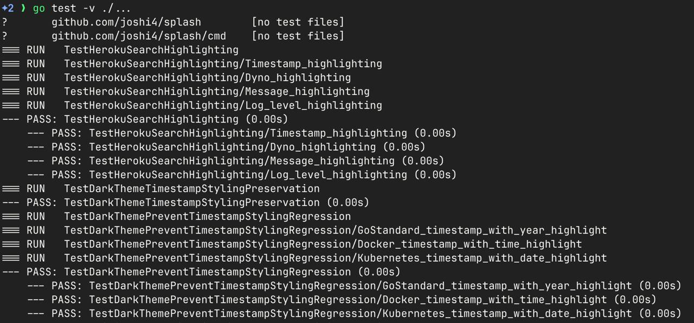
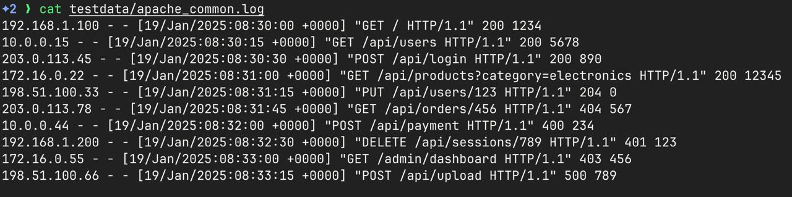

Splash adds beautiful, adaptive colors to make logs easier to read.

## Features

- **Auto-detection** of 16 popular log formats including programming language stack traces
- **Mixed formats** - handles multiple log formats in a single stream
- **Search highlighting** with string or regex patterns
- **Adaptive colors** that work with both light and dark terminals
- **Streaming performance** - processes logs in real-time
- **Zero configuration** - No config. Just pipe.

## Screenshots

Splash supports many standard log formats and output from popular languages like go (test logs), java (exceptions), and python (tracebacks)
<table>
  <tr>
    <td></td>
    <td></td>
  </tr>
  <tr>
    <td align="center"><b>go test -v ./... </b><br/></td>
    <td align="center"><b>go test -v ./... | splash </b><br/></td>
  </tr>

  <tr>
    <td></td>
    <td></td>
  </tr>
  <tr>
    <td align="center"><b> Syslog Logs </b><br/></td>
    <td align="center"><b> Scan for strings easily with splash --search </b><br/></td>
  </tr>

  <tr>
    <td></td>
    <td></td>
  </tr>
  <tr>
    <td align="center"><b> Apache format logs </b><br/></td>
    <td align="center"><b> splash -r "08:3\d" to highlight all timestamps that match the regex pattern </b><br/></td>
  </tr>

</table>

## Installation

### Install from Homebrew (Recommended)

```bash
brew tap joshi4/splash
brew install splash
```

### For Linux users

```bash
curl -fsSL https://install.getsplash.sh | sh
```

### For Go users

```bash
go install github.com/joshi4/splash@latest
```

## Get Started

The easiest way to use Splash is to pipe any log output through it:


### Basic Usage
```bash
echo '{"timestamp":"2025-01-19T10:30:00Z","level":"ERROR","message":"Connection failed","service":"api"}' | splash
```

### Highlight errors
```bash
{ echo '{"level":"INFO","msg":"Starting up"}'; echo '{"level":"ERROR","msg":"Connection failed"}'; echo '{"level":"WARN","msg":"Slow query"}'; } | splash -s "ERROR"
```

### Create HTTP logs and highlight error status codes
```bash
{ echo '192.168.1.1 - - [19/Jan/2025:10:30:00 +0000] "GET /api HTTP/1.1" 200 1234'; echo '192.168.1.2 - - [19/Jan/2025:10:30:01 +0000] "POST /api HTTP/1.1" 404 567'; } | splash -r "[45]\d\d"
```

### Generate and monitor continuous output
```bash
while true; do echo "$(date -Iseconds) INFO Server is healthy"; sleep 2; done | splash
```

### Create a mix of log formats to test detection
```bash
{
  echo 'Jan 19 10:30:00 localhost myapp[1234]: INFO Application started'
  echo '{"timestamp":"2025-01-19T10:30:01Z","level":"WARN","message":"High memory usage"}'
  echo '127.0.0.1 - - [19/Jan/2025:10:30:02 +0000] "GET /health HTTP/1.1" 200 15'
} | splash
```

### Use with curl to monitor API responses (requires jq)
```bash
curl -s httpbin.org/json | jq -c . | splash
```
## 🔧 Command Line Options

```bash
splash [flags]

Flags:
  -s, --search string    Highlight lines containing this text
  -r, --regexp string    Highlight lines matching this regex pattern
  -h, --help            Show help information
```

**Note:** You cannot use both `-s` and `-r` flags simultaneously.

## Programming Language Features

Splash provides specialized support for debugging and development outputs from popular programming languages:

| Format | Example |
|--------|---------|
| **JavaScript Stack Traces** | ```Error<br>    at sum (/home/dev/Documents/trace.js:2:17)<br>    at start (/home/dev/Documents/trace.js:11:13)<br>    at Object.<anonymous> (/home/dev/Documents/trace.js:16:1)``` |
| **Go Stack Traces** | ```goroutine 1 [running]:<br>main.Example(0x2080c3f50, 0x2, 0x4, 0x425c0, 0x5, 0xa)<br>        /Users/bill/Spaces/Go/Projects/src/github.com/goinaction/code/temp/main.go:9 +0x64``` |
| **Java Exceptions** | ```Exception in thread "main" java.lang.ArithmeticException: / by zero<br>	at com.example.MyClass.divide(MyClass.java:10)<br>	at com.example.MyClass.calculate(MyClass.java:6)``` |
| **Python Exceptions** | ```Traceback (most recent call last):<br>  File "example_trace.py", line 21, in <module><br>    function_a()<br>ZeroDivisionError: division by zero``` |
| **Go Test Output** | ```=== RUN TestReconcileCreatesServiceAccounts<br>--- PASS: TestName(0.00s)<br>=== RUN TestSportReconcilerCreatesNamespace``` |

## Standard Log Formats

Splash automatically detects and colorizes these conventional log formats:

| Format | Example |
|--------|---------|
| **JSON** | `{"timestamp":"2025-01-19T10:30:00Z","level":"ERROR","message":"DB failed"}` |
| **Logfmt** | `timestamp=2025-01-19T10:30:00Z level=error msg="DB failed" service=api` |
| **Apache Common** | `127.0.0.1 - - [19/Jan/2025:10:30:00 +0000] "GET /api HTTP/1.1" 200 1234` |
| **Nginx** | `127.0.0.1 - - [19/Jan/2025:10:30:00 +0000] "GET /api HTTP/1.1" 200 1234 "-" "Mozilla/5.0"` |
| **Syslog** | `Jan 19 10:30:00 hostname myapp[1234]: ERROR: Database connection failed` |
| **Rsyslog** | `Aug  8 00:15:23 your-macbook-pro syslogd[347]: ASL Sender Statistics` |
| **Go Standard** | `2025/01/19 10:30:00 ERROR: Database connection failed` |
| **Rails** | `[2025-01-19 10:30:00] ERROR -- : Database connection failed` |
| **Docker** | `2025-01-19T10:30:00.123456789Z ERROR Database connection failed` |
| **Kubernetes** | `2025-01-19T10:30:00.123Z 1 main.go:42] ERROR Database connection failed` |
| **Heroku** | `2025-01-19T10:30:00+00:00 app[web.1]: ERROR Database connection failed` |

## Build from Source

```bash
git clone https://github.com/joshi4/splash.git
cd splash
go build
```

## FAQ

**I'm using a supported log format but it's not being detected. What should I do?**

Sometimes logs are written to stderr instead of stdout. Try redirecting stderr to stdout:

```bash
your_command 2>&1 | splash
```

## Contributing

1. Fork the repository
2. Create a feature branch: `git checkout -b feature-name`
3. Make your changes and add tests
4. Run tests: `go test ./...`
5. Submit a pull request
